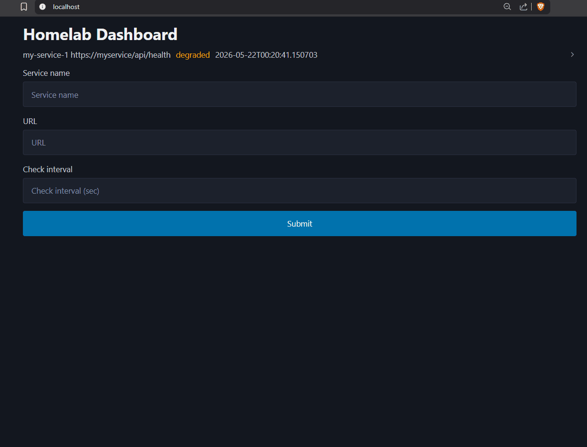
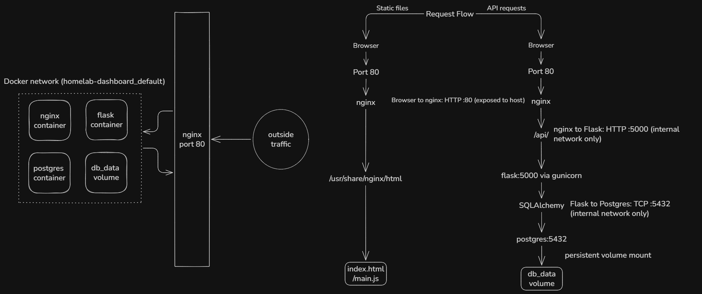

# Homelab Status Dashboard

A self-hosted service health monitoring dashboard built to demonstrate 
production-grade containerization and Flask API patterns.




## Architecture


Requests flow: Browser → nginx (port 80) → Flask app (internal network, port 5000) → Postgres (internal network, port 5432). nginx also serves static frontend assets directly without proxying to Flask.

## Docker Info


## Tech Stack

- **Backend:** Python 3.13, Flask, SQLAlchemy, Pydantic
- **Database:** PostgreSQL 14
- **Frontend:** Vanilla JS, HTML, Pico.css
- **Infrastructure:** Docker, Docker Compose, nginx
- **Package management:** uv (pip alternative also provided)


## Quick Start

```bash
git clone https://github.com/Ehan1213/homelab-dashboard
cp .env.example .env        # fill in your values
docker compose up
```

You'll see the dashboard at `http://localhost` in your browser.
The API is at `http://localhost/api/services`.

## Environment Variables

Copy `.env.example` to `.env` and fill in the values:

```env
POSTGRES_USER=postgres
POSTGRES_PASSWORD=your-password
POSTGRES_DB=your-db-name
SQLALCHEMY_DATABASE_URI=postgresql+psycopg2://postgres:your-password@db:5432/your-db-name
```

# Flask Dockerfiles
I used uv in this project if you are less familiar there is a pip
dockerfile with the requrired deps in a traditional requirements.txt this must be kept in sync manually.

## What This Demonstrates

**Flask & Python**
- Application Factory pattern for testable, configurable Flask apps
- Blueprint-based route organization
- SQLAlchemy 2.0 with fully typed mapped columns
- Pydantic v2 request validation with shared enum types
- Separation of concerns: routes -> validation -> models -> serialization

**Infrastructure & DevOps**
- Multi-stage Docker builds — builder stage installs dependencies, 
  runtime stage ships only what's needed
- Non-root container users (`app` for Flask, `nginx` for nginx workers)
- Custom Python healthcheck script with Docker `HEALTHCHECK` directive
- Service dependency ordering with `condition: service_healthy` nginx 
  waits for Flask, Flask waits for Postgres
- nginx is the single entry point all static files are served by nginx rather than the application server
- Reverse proxy configuration with upstream headers 
  (X-Real-IP, X-Forwarded-For)
- Named Docker volumes for Postgres data persistence
- Dev/prod Compose split — Adminer only in development
- Two Dockerfile variants (uv and pip) for contributor flexibility
- Base image security patching with `apk upgrade --no-cache`

**API Design**
- RESTful resource-based URL structure
- Consistent JSON error responses
- Proper HTTP status codes (200, 201, 400, 404, 503)
- Input validation with descriptive error messages via pydantic
- Shared enum types between validation and database layers


# Future Work
- [ ] Add joinedload for related service data on check queries
- [ ] Python Background worker
- [ ] Kubernetes manifests (Deployments, Services, Ingress, HPA)
- [ ] Terraform IaC for infrastructure provisioning
- [ ] GitHub Actions CI/CD pipeline
- [ ] Alembic database migrations